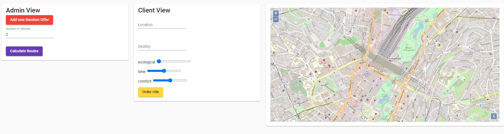
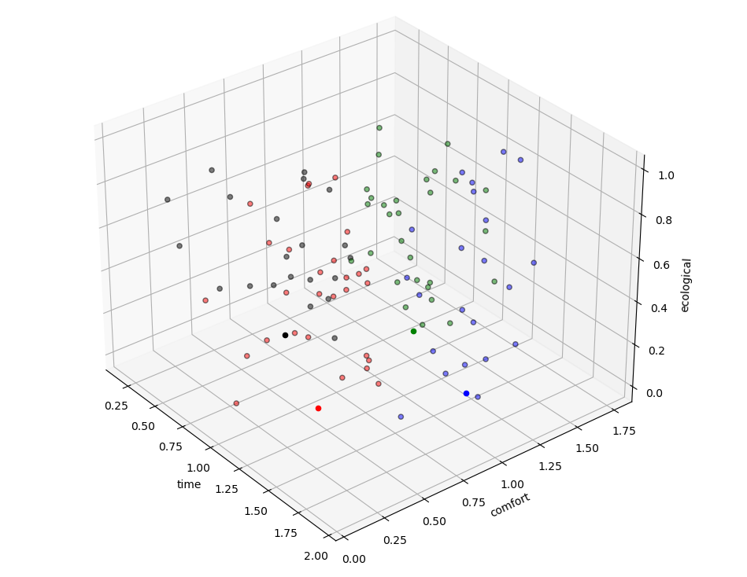
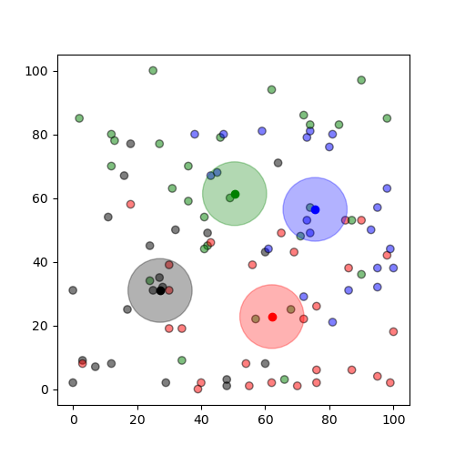
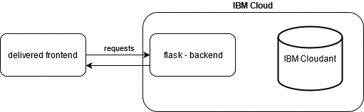

# Prototype Architecture

This codebase should demonstrate a simple implementation of the business idea.
It represents the abstracted and simplified idea of the grouping algorithms.
It consists of two major parts: **the front and backend**

# Frontend
The frontend is a simple angular application.
The frontend directory contains the source files of the angular application.
It can be hosted through the backend.

The frontend offers different functionality.

The ``Client View`` window represents the common user of the app.
This user want to order a ride from place A to place B. In this demo this idea represents a order. 
As part of the business idea additional settings are provided.
With the three toggles the user can decide how he wants to ride by adjusting the importance:
- ecological: e.g. short routes, high utilization of buses 
- time: the shortest route possible
- comfort: e.g. empty buses, comfort interior

The ``Admin View`` window represents the background worker of the app.
For demo purposes the "Add new Random Offer" button creates a random offer and sends them to the backend.

The "Number of Vehicles" input is a necessary value for the routing.  
The "Calculate Routes" button invokes the routing process.  
This process gathers all orders and clusters them depending on there ride settings.
This is achieved through machine learning algorithms in the backend.  
  
Each of these clusters represents a group of people with similar ride characteristics.
As a single vehicle will pick up exactly this group of people, the mean of the location of this group is calculated.
This center point is used as pick up point where the driver can pick up each person.  
  

The result of this calculation is returned to the frontend.

The openstreetmap to the right is used to present the different results. First of all it represents the start location of all current orders.  
In case the result of the routing process has been returned, each of these points is colored in their cluster color.

# Backend
The backend is written in python and uses the [flask webserver framework](https://flask.palletsprojects.com/en/1.1.x/) and a instance of the ibm database [Cloudant](https://www.ibm.com/de-de/cloud/cloudant).

The backend provides simple api functionality and also delivers the frontend.
This backend contains configuration files to deployed the application to the IBM Cloud.

The backend has been deployed and can be reached through this link: 
https://getstartedpython-egregious-crane-ij.eu-gb.mybluemix.net/

The backend offers some simple functionality. The flask framework delivers the static web page content, but also some api endpoints.
The api endpoints are used to create and get the orders. These endpoints are transferring data from and to the database.
The cloudant database is used to store the current orders to the application.

The routing process can be started through the admin controller.

For demonstration purposes it is possible to only look start the routing process.
This will also use additional libraries to display the result in a graphical output.
[How to start routing process](backend/README.md#-2.1-Only-Run-the-data-calulation)
