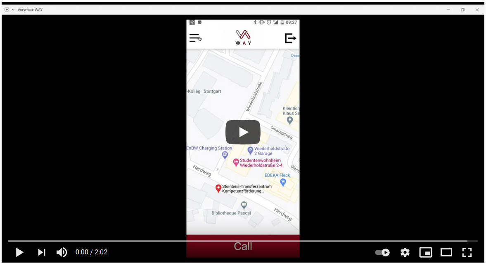

# Wireframes
Für ein besseres Verständniss der Abläufe in unserer Idee, haben wir eine Beispiels App entworfen.
Diese wurde mithilfe von Adobe XD entworfen und umgesetzt.

## Live Demo
Über folgenden Link lässt sich eine Live-Hands-On Prototyp finden:  
https://xd.adobe.com/view/718da0be-e8ef-4206-b6a8-1db5f568cda9-24de/?fullscreen  

## Video Demo
